# AC one

## Outline

- [1. Hardware](#1-hardware)
  - [1.1 Structure](#1-1-structure)
  - [1.2 Connection](#1-2-connection)
- [2. Download](#2-download)
- [3. Build](#3-build)
  - [3.1 01make](#3-1-01make)
  - [3.2 Camera Configuration](#3-2-camera-configuration)
- [4. Data Collection](#4-data-collection)
- [5. Data Validation](#5-data-validation)
  - [5.1 Data Visualization](#5-1-data-visualization)
    - [5.1.1 episode_0_action_base.png](#5-1-1-episode_0_action_basepng)
    - [5.1.2 episode_0_action_velocity.png](#5-1-2-episode_0_action_velocitypng)
    - [5.1.3 episode_0_eef.png](#5-1-3-episode_0_eefpng)
    - [5.1.4 episode_0_qpos.png](#5-1-4-episode_0_qpospng)
    - [5.1.5 episode_0_qvel.png](#5-1-5-episode_0_qvelpng)
    - [5.1.6 episode_0_video.mp4](#5-1-6-episode_0_videomp4)
- [6. Training](#6-training)

<a id="1-hardware"></a>
## 1. Hardware

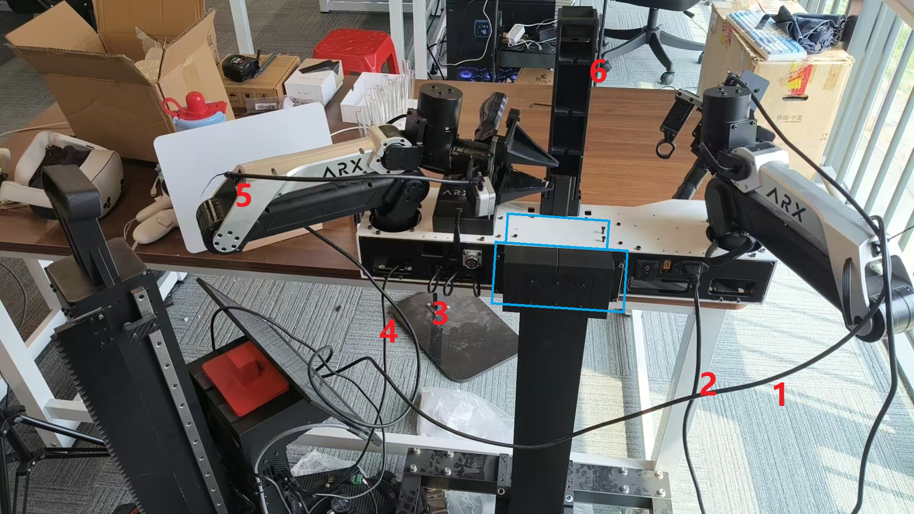

<a id="1-1-structure"></a>
### 1.1 Structure
使用蓝色况中的共8xM3螺丝连接机械臂模块与底座

<a id="1-2-connection"></a>
### 1.2 Connection
共6根线：
1. 右手腕realsense相机usb线
2. 电源线，连接插排
3. 机械臂内置usb hub（下），和can控制器（上），左臂对应can1（左侧），右臂can3（右侧），最 上面带“1234”的按键控制盒也要连接hub
4. usb hub   数据线，连接NUC，可用usb2.0
5. 左手腕realsense相机usb线
6. top realsense相机usb线

<a id="2-download"></a>
## 2. Download
```
Download
mkdir ~/WBCD && cd WBCD
git clone https://github.com/ChangerC77/ROS2_AC-one_Play.git
git clone https://github.com/ChangerC77/ARX_X5.git
cd ROS2_AC-one_Play
git submodule update --init
```
<details>
<summary>output</summary>
```
正克隆到 'ROS2_AC-one_Play'...
remote: Enumerating objects: 475, done.
remote: Counting objects: 100% (475/475), done.
remote: Compressing objects: 100% (330/330), done.
remote: Total 475 (delta 155), reused 452 (delta 132), pack-reused 0 (from 0)
接收对象中: 100% (475/475), 20.86 MiB | 1.76 MiB/s, 完成.
处理 delta 中: 100% (155/155), 完成.
正克隆到 'ARX_X5'...
remote: Enumerating objects: 943, done.
remote: Counting objects: 100% (47/47), done.
remote: Compressing objects: 100% (37/37), done.
remote: Total 943 (delta 12), reused 32 (delta 6), pack-reused 896 (from 1)
接收对象中: 100% (943/943), 100.12 MiB | 5.01 MiB/s, 完成.
处理 delta 中: 100% (230/230), 完成.
子模组 'ARX_all_in_one_readme'（https://github.com/ARXroboticsX/ARX_all_in_one_readme）已对路径 'ARX_all_in_one_readme' 注册
正克隆到 '/home/arx/test/ROS2_AC-one_Play/ARX_all_in_one_readme'...
子模组路径 'ARX_all_in_one_readme'：检出 '75d410ce153ffa4dc893d5f24a74865f1456662f'
```
</details>

<a id="3-build"></a>
## 3. Build
```
cd ~/WBCD/ROS2_AC-one_Play/realsense
colcon build
```
output
```
Starting >>> realsense2_camera_msgs
Finished <<< realsense2_camera_msgs [4.62s]                     
Starting >>> realsense2_camera
Starting >>> realsense2_description
Finished <<< realsense2_description [0.62s]                           
Finished <<< realsense2_camera [15.8s]                       

Summary: 3 packages finished [20.5s]```
```
<a id="3-1-01make"></a>
### 3.1 01make
```
cd ~/WBCD/ARX_X5/00-sh/ROS2/AC_one
./01make.sh
```
this will create 2 new tabs
output
```
# 选项“-x”已弃用并可能在 gnome-terminal 的后续版本中移除。
# 使用“-- ”以结束选项并将要执行的命令行追加至其后。
# 选项“-x”已弃用并可能在 gnome-terminal 的后续版本中移除。
# 使用“-- ”以结束选项并将要执行的命令行追加至其后。
```
tab 1
```
Starting >>> arm_control
Starting >>> arx5_arm_msg
Finished <<< arx5_arm_msg [3.25s]                                   
--- stderr: arm_control                             
CMake Warning:
  Manually-specified variables were not used by the project:

    CATKIN_INSTALL_INTO_PREFIX_ROOT


---
Finished <<< arm_control [3.53s]
Starting >>> arx_x5_controller
Finished <<< arx_x5_controller [14.5s]                       

Summary: 3 packages finished [18.1s]
  1 package had stderr output: arm_control
```
tab 2
```
Starting >>> arx_joy 
Finished <<< arx_joy [3.94s]                     

Summary: 1 package finished [4.02s]
```
<a id="3-2-camera-configuration"></a>
### 3.2 Camera Configuration
```
cd ~/WBCD/ROS2_AC-one_Play/realsense
./search.sh
```
output
```
Found 3 device(s):
  - Serial: 230422272806 , USB: 3.2
  - Serial: 218622274187 , USB: 3.2
  - Serial: 352122270955 , USB: 3.2
Press any key in the image window(s) to exit...
```
and this will create 3 windows which demonstrate the instant view from 3 cameras
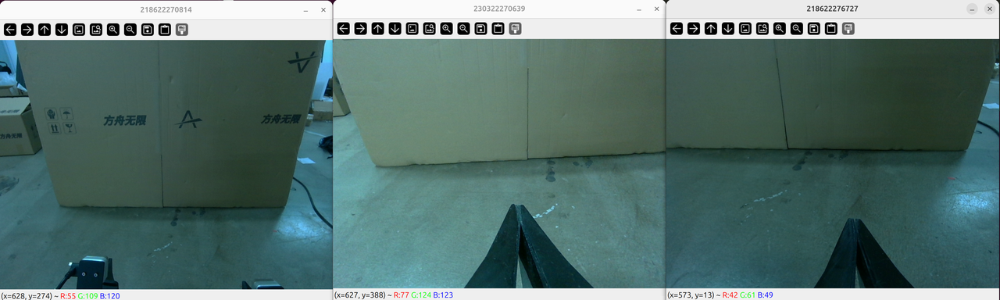

显示的图像对应的标题及为其序列号，根据图像判断左右和头部，将获取到的`Serial number`填入
到`ROS2_AC-one_Play/realsense/realsense.sh` 中

```
declare -A CAMS=(
  [camera_h]="352122270955"
  [camera_l]="218622274187"
  [camera_r]="230422272806"
)
```

<a id="4-data-collection"></a>
## 4. Data Collection
```
cd ~/WBCD/ROS2_AC-one_Play/tools
./01collect.sh
```
output
```
# 选项“-x”已弃用并可能在 gnome-terminal 的后续版本中移除。
# 使用“-- ”以结束选项并将要执行的命令行追加至其后。
# 选项“-x”已弃用并可能在 gnome-terminal 的后续版本中移除。
# 使用“-- ”以结束选项并将要执行的命令行追加至其后。
# 选项“-x”已弃用并可能在 gnome-terminal 的后续版本中移除。
# 使用“-- ”以结束选项并将要执行的命令行追加至其后。
# 选项“-x”已弃用并可能在 gnome-terminal 的后续版本中移除。
# 使用“-- ”以结束选项并将要执行的命令行追加至其后。
# 选项“-x”已弃用并可能在 gnome-terminal 的后续版本中移除。
# 使用“-- ”以结束选项并将要执行的命令行追加至其后。
# 选项“-x”已弃用并可能在 gnome-terminal 的后续版本中移除。
# 使用“-- ”以结束选项并将要执行的命令行追加至其后。
# 选项“-x”已弃用并可能在 gnome-terminal 的后续版本中移除。
# 使用“-- ”以结束选项并将要执行的命令行追加至其后
```
new tab 1 (can1)
```
CAN 接口 can1 正常工作
```
new tab 2 (can 3)
```
CAN 接口 can3 正常工作
```
new tab 3 (can 6)
```
CAN 接口 can6 正常工作
```
new tab 4 (lift)
```
[X5Controller-1] ARX方舟无限
[X5Controller-2] ARX方舟无限
```
new tab 5 (joy)
```
SocketCAN adapter created.
Created CAN socket with descriptor 19.
Found: can6 has interface index 8.
Successfully bound socket to interface 8.
ReciveThread running
```
new tab 6
```
camera_r -> serial=_230422272806
camera_l -> serial=_218622274187
camera_h -> serial=_352122270955
```
<details>
<summary>new tab 7 (camera_r)</summary>

```
[INFO] [launch]: All log files can be found below /home/arx/.ros/log/2026-04-09-19-09-24-737280-arx-3680807
[INFO] [launch]: Default logging verbosity is set to INFO
[INFO] [launch.user]: 🚀 Launching as Normal ROS Node
[INFO] [realsense2_camera_node-1]: process started with pid [3681691]
[realsense2_camera_node-1] [INFO] [1775732965.206019103] [camera.camera_r]: RealSense ROS v4.56.0
[realsense2_camera_node-1] [INFO] [1775732965.206170850] [camera.camera_r]: Built with LibRealSense v2.56.5
[realsense2_camera_node-1] [INFO] [1775732965.206190609] [camera.camera_r]: Running with LibRealSense v2.56.5
[realsense2_camera_node-1] [INFO] [1775732965.216263015] [camera.camera_r]: Device with serial number 230422272806 was found.
[realsense2_camera_node-1] 
[realsense2_camera_node-1] [INFO] [1775732965.216355464] [camera.camera_r]: Device with physical ID /sys/devices/pci0000:00/0000:00:0d.0/usb2/2-3/2-3:1.0/video4linux/video0 was found.
[realsense2_camera_node-1] [INFO] [1775732965.216372919] [camera.camera_r]: Device with name Intel RealSense D405 was found.
[realsense2_camera_node-1] [INFO] [1775732965.217818875] [camera.camera_r]: Device with port number 2-3 was found.
[realsense2_camera_node-1] [INFO] [1775732965.217867430] [camera.camera_r]: Device USB type: 3.2
[realsense2_camera_node-1] [INFO] [1775732965.218022456] [camera.camera_r]: getParameters...
[realsense2_camera_node-1] [INFO] [1775732965.218744069] [camera.camera_r]: JSON file is not provided
[realsense2_camera_node-1] [INFO] [1775732965.218773365] [camera.camera_r]: Device Name: Intel RealSense D405
[realsense2_camera_node-1] [INFO] [1775732965.218779533] [camera.camera_r]: Device Serial No: 230422272806
[realsense2_camera_node-1] [INFO] [1775732965.218783430] [camera.camera_r]: Device physical port: /sys/devices/pci0000:00/0000:00:0d.0/usb2/2-3/2-3:1.0/video4linux/video0
[realsense2_camera_node-1] [INFO] [1775732965.218787218] [camera.camera_r]: Device FW version: 5.17.0.10
[realsense2_camera_node-1] [INFO] [1775732965.218791343] [camera.camera_r]: Device Product ID: 0x0B5B
[realsense2_camera_node-1] [INFO] [1775732965.218794961] [camera.camera_r]: Sync Mode: Off
[realsense2_camera_node-1] [WARN] [1775732965.312956875] [camera.camera_r]: re-enable the stream for the change to take effect.
[realsense2_camera_node-1] [WARN] [1775732965.313970664] [camera.camera_r]: re-enable the stream for the change to take effect.
[realsense2_camera_node-1] [INFO] [1775732965.314932441] [camera.camera_r]: Set ROS param depth_module.infra_profile to default: 848x480x30
[realsense2_camera_node-1] [INFO] [1775732965.319483395] [camera.camera_r]: Stopping Sensor: Depth Module
[realsense2_camera_node-1] [INFO] [1775732965.332225126] [camera.camera_r]: Starting Sensor: Depth Module
[realsense2_camera_node-1] [INFO] [1775732965.341510583] [camera.camera_r]: Open profile: stream_type: Color(0), Format: RGB8, Width: 640, Height: 480, FPS: 90
[realsense2_camera_node-1] [INFO] [1775732965.341571148] [camera.camera_r]: Open profile: stream_type: Depth(0), Format: Z16, Width: 640, Height: 480, FPS: 90
[realsense2_camera_node-1] [INFO] [1775732965.345891564] [camera.camera_r]: RealSense Node Is Up!
```
</details>

<details>
<summary>new tab 8 (camera_l)</summary>

```
[INFO] [launch]: All log files can be found below /home/arx/.ros/log/2026-04-09-19-09-25-874522-arx-3685757
[INFO] [launch]: Default logging verbosity is set to INFO
[INFO] [launch.user]: 🚀 Launching as Normal ROS Node
[INFO] [realsense2_camera_node-1]: process started with pid [3686671]
[realsense2_camera_node-1] [INFO] [1775732965.994204877] [camera.camera_l]: RealSense ROS v4.56.0
[realsense2_camera_node-1] [INFO] [1775732965.994420984] [camera.camera_l]: Built with LibRealSense v2.56.5
[realsense2_camera_node-1] [INFO] [1775732965.994442088] [camera.camera_l]: Running with LibRealSense v2.56.5
[realsense2_camera_node-1] [INFO] [1775732966.003644109] [camera.camera_l]: Device with serial number 230422272806 was found.
[realsense2_camera_node-1] 
[realsense2_camera_node-1] [INFO] [1775732966.003699315] [camera.camera_l]: Device with physical ID /sys/devices/pci0000:00/0000:00:0d.0/usb2/2-3/2-3:1.0/video4linux/video0 was found.
[realsense2_camera_node-1] [INFO] [1775732966.003707409] [camera.camera_l]: Device with name Intel RealSense D405 was found.
[realsense2_camera_node-1] [INFO] [1775732966.004235928] [camera.camera_l]: Device with port number 2-3 was found.
[realsense2_camera_node-1] [INFO] [1775732966.006452678] [camera.camera_l]: Device with serial number 218622274187 was found.
[realsense2_camera_node-1] 
[realsense2_camera_node-1] [INFO] [1775732966.006494735] [camera.camera_l]: Device with physical ID /sys/devices/pci0000:00/0000:00:0d.0/usb2/2-4/2-4:1.0/video4linux/video6 was found.
[realsense2_camera_node-1] [INFO] [1775732966.006501198] [camera.camera_l]: Device with name Intel RealSense D405 was found.
[realsense2_camera_node-1] [INFO] [1775732966.006992187] [camera.camera_l]: Device with port number 2-4 was found.
[realsense2_camera_node-1] [INFO] [1775732966.007002328] [camera.camera_l]: Device USB type: 3.2
[realsense2_camera_node-1] [INFO] [1775732966.007088095] [camera.camera_l]: getParameters...
[realsense2_camera_node-1] [INFO] [1775732966.007836999] [camera.camera_l]: JSON file is not provided
[realsense2_camera_node-1] [INFO] [1775732966.007865855] [camera.camera_l]: Device Name: Intel RealSense D405
[realsense2_camera_node-1] [INFO] [1775732966.007877573] [camera.camera_l]: Device Serial No: 218622274187
[realsense2_camera_node-1] [INFO] [1775732966.007887466] [camera.camera_l]: Device physical port: /sys/devices/pci0000:00/0000:00:0d.0/usb2/2-4/2-4:1.0/video4linux/video6
[realsense2_camera_node-1] [INFO] [1775732966.007898541] [camera.camera_l]: Device FW version: 5.12.14.100
[realsense2_camera_node-1] [INFO] [1775732966.007908292] [camera.camera_l]: Device Product ID: 0x0B5B
[realsense2_camera_node-1] [INFO] [1775732966.007916788] [camera.camera_l]: Sync Mode: Off
[realsense2_camera_node-1] [WARN] [1775732966.101704343] [camera.camera_l]: re-enable the stream for the change to take effect.
[realsense2_camera_node-1] [WARN] [1775732966.103716357] [camera.camera_l]: re-enable the stream for the change to take effect.
[realsense2_camera_node-1] [INFO] [1775732966.106611564] [camera.camera_l]: Set ROS param depth_module.infra_profile to default: 848x480x30
[realsense2_camera_node-1] [INFO] [1775732966.115666775] [camera.camera_l]: Stopping Sensor: Depth Module
[realsense2_camera_node-1] [INFO] [1775732966.128751473] [camera.camera_l]: Starting Sensor: Depth Module
[realsense2_camera_node-1] [INFO] [1775732966.138430293] [camera.camera_l]: Open profile: stream_type: Color(0), Format: RGB8, Width: 640, Height: 480, FPS: 90
[realsense2_camera_node-1] [INFO] [1775732966.138507368] [camera.camera_l]: Open profile: stream_type: Depth(0), Format: Z16, Width: 640, Height: 480, FPS: 90
[realsense2_camera_node-1] [INFO] [1775732966.142891600] [camera.camera_l]: RealSense Node Is Up!
```
</details>

<details>
<summary> new tab 9 (camera_h) </summary>

```
[INFO] [launch]: All log files can be found below /home/arx/.ros/log/2026-04-09-19-09-27-116160-arx-3690929
[INFO] [launch]: Default logging verbosity is set to INFO
[INFO] [launch.user]: 🚀 Launching as Normal ROS Node
[INFO] [realsense2_camera_node-1]: process started with pid [3691869]
[realsense2_camera_node-1] [INFO] [1775732967.242334008] [camera.camera_h]: RealSense ROS v4.56.0
[realsense2_camera_node-1] [INFO] [1775732967.242484750] [camera.camera_h]: Built with LibRealSense v2.56.5
[realsense2_camera_node-1] [INFO] [1775732967.242505274] [camera.camera_h]: Running with LibRealSense v2.56.5
[realsense2_camera_node-1] [INFO] [1775732967.251894610] [camera.camera_h]: Device with serial number 230422272806 was found.
[realsense2_camera_node-1] 
[realsense2_camera_node-1] [INFO] [1775732967.251949393] [camera.camera_h]: Device with physical ID /sys/devices/pci0000:00/0000:00:0d.0/usb2/2-3/2-3:1.0/video4linux/video0 was found.
[realsense2_camera_node-1] [INFO] [1775732967.251958328] [camera.camera_h]: Device with name Intel RealSense D405 was found.
[realsense2_camera_node-1] [INFO] [1775732967.252498405] [camera.camera_h]: Device with port number 2-3 was found.
[realsense2_camera_node-1] [INFO] [1775732967.254586259] [camera.camera_h]: Device with serial number 218622274187 was found.
[realsense2_camera_node-1] 
[realsense2_camera_node-1] [INFO] [1775732967.254618984] [camera.camera_h]: Device with physical ID /sys/devices/pci0000:00/0000:00:0d.0/usb2/2-4/2-4:1.0/video4linux/video6 was found.
[realsense2_camera_node-1] [INFO] [1775732967.254625234] [camera.camera_h]: Device with name Intel RealSense D405 was found.
[realsense2_camera_node-1] [INFO] [1775732967.255111808] [camera.camera_h]: Device with port number 2-4 was found.
[realsense2_camera_node-1] [INFO] [1775732967.256972469] [camera.camera_h]: Device with serial number 352122270955 was found.
[realsense2_camera_node-1] 
[realsense2_camera_node-1] [INFO] [1775732967.257014289] [camera.camera_h]: Device with physical ID /sys/devices/pci0000:00/0000:00:14.0/usb4/4-1/4-1:1.0/video4linux/video12 was found.
[realsense2_camera_node-1] [INFO] [1775732967.257029731] [camera.camera_h]: Device with name Intel RealSense D405 was found.
[realsense2_camera_node-1] [INFO] [1775732967.258416092] [camera.camera_h]: Device with port number 4-1 was found.
[realsense2_camera_node-1] [INFO] [1775732967.258449503] [camera.camera_h]: Device USB type: 3.2
[realsense2_camera_node-1] [INFO] [1775732967.258603886] [camera.camera_h]: getParameters...
[realsense2_camera_node-1] [INFO] [1775732967.259462624] [camera.camera_h]: JSON file is not provided
[realsense2_camera_node-1] [INFO] [1775732967.259488651] [camera.camera_h]: Device Name: Intel RealSense D405
[realsense2_camera_node-1] [INFO] [1775732967.259501684] [camera.camera_h]: Device Serial No: 352122270955
[realsense2_camera_node-1] [INFO] [1775732967.259513649] [camera.camera_h]: Device physical port: /sys/devices/pci0000:00/0000:00:14.0/usb4/4-1/4-1:1.0/video4linux/video12
[realsense2_camera_node-1] [INFO] [1775732967.259523992] [camera.camera_h]: Device FW version: 5.17.0.10
[realsense2_camera_node-1] [INFO] [1775732967.259534036] [camera.camera_h]: Device Product ID: 0x0B5B
[realsense2_camera_node-1] [INFO] [1775732967.259542817] [camera.camera_h]: Sync Mode: Off
[realsense2_camera_node-1] [WARN] [1775732967.351126828] [camera.camera_h]: re-enable the stream for the change to take effect.
[realsense2_camera_node-1] [WARN] [1775732967.352253068] [camera.camera_h]: re-enable the stream for the change to take effect.
[realsense2_camera_node-1] [INFO] [1775732967.353340118] [camera.camera_h]: Set ROS param depth_module.infra_profile to default: 848x480x30
[realsense2_camera_node-1] [INFO] [1775732967.362559837] [camera.camera_h]: Stopping Sensor: Depth Module
[realsense2_camera_node-1] [INFO] [1775732967.385881962] [camera.camera_h]: Starting Sensor: Depth Module
[realsense2_camera_node-1] [INFO] [1775732967.395285719] [camera.camera_h]: Open profile: stream_type: Color(0), Format: RGB8, Width: 640, Height: 480, FPS: 90
[realsense2_camera_node-1] [INFO] [1775732967.395364399] [camera.camera_h]: Open profile: stream_type: Depth(0), Format: Z16, Width: 640, Height: 480, FPS: 90
[realsense2_camera_node-1] [INFO] [1775732967.400026948] [camera.camera_h]: RealSense Node Is Up!
```

</details>

new tab 10 (collect)
```
Episode 0
Preparing to record episode 0
waiting 0 to start recording
Start recording program...
```
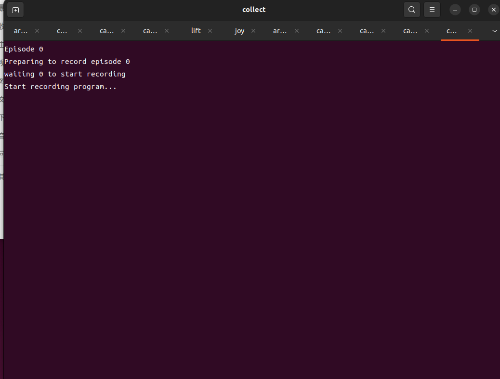

When start, the arm will reach this status

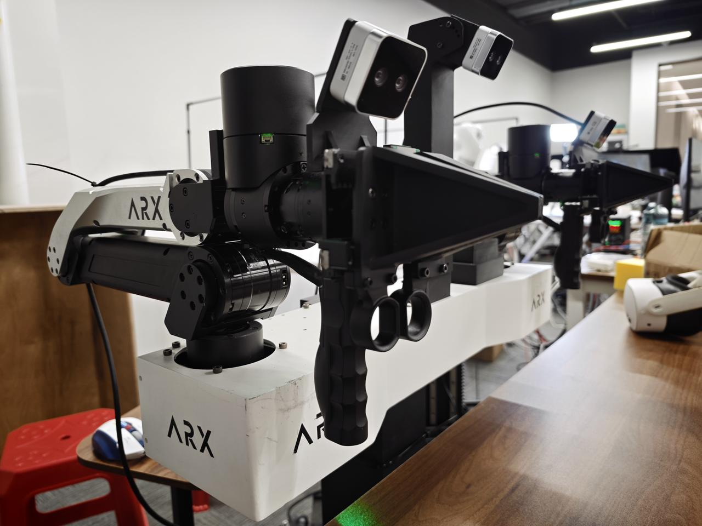

then, press button `2` in controller box

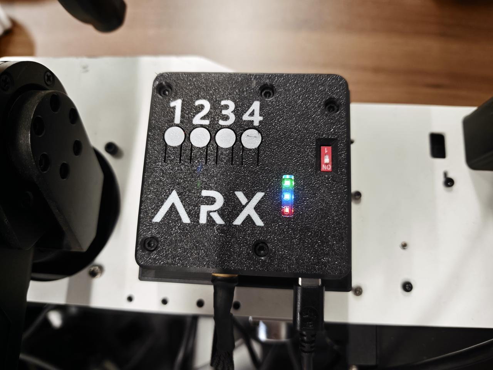

the arm will achieve this status:

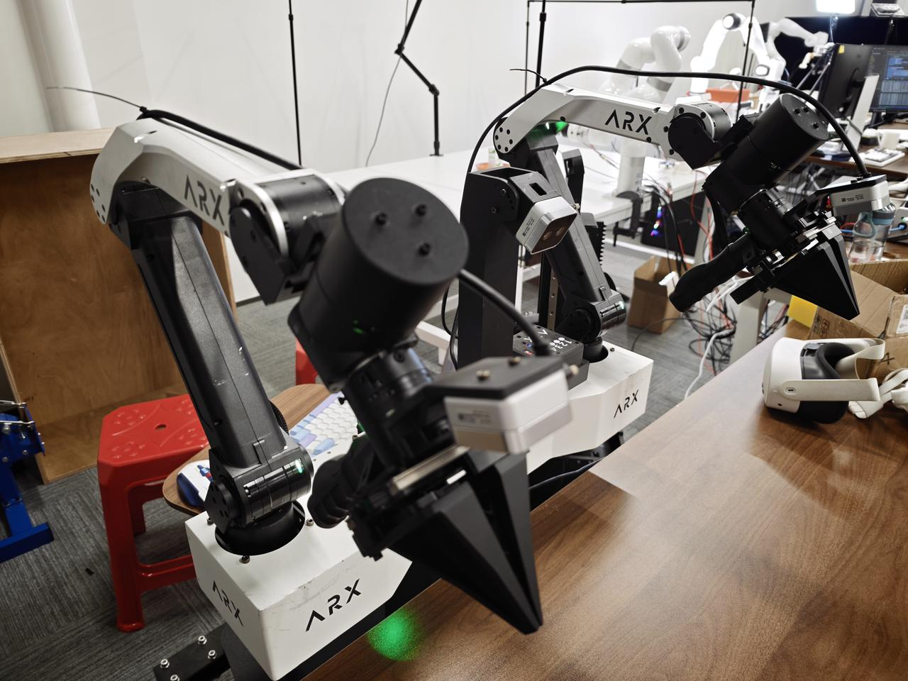

continue to press button `1` on controller box, then the voice from pc said go, it will start to collect data

```
Episode 0
Preparing to record episode 10
waiting 0 to start recording
Start recording program...
10
go
Start to record episode 10
Frame data: 1
Frame data: 2
Frame data: 3
Frame data: 4
Frame data: 5
Frame data: 6
Frame data: 7
Frame data: 8
Frame data: 9
Frame data: 10
```
press button `2` to stop collection and save dataset, save path in `ROS2_AC-one_Play/act/datasets/`

output
```
len(timesteps): 101
len(actions)  : 101
Episode 1
Preparing to record episode 11
waiting 0 to start recording
Start recording program...
Save

Saved in 1.3s: /home/arx/WBCD/ROS2_AC-one_Play/act/datasets/episode_0
```
when occur `saved ...` , continue to press `1` to collect data, and press `2` to stop collect data.

<a id="5-data-validation"></a>
## 5. Data Validation
<a id="5-1-data-visualization"></a>
### 5.1 Data Visualization
```
python ~/WBCD/ROS2_AC-one_Play/act/visualize.py
```
output
```
output
Saved video to: /home/arx/WBCD/ROS2_AC-one_Play/act/datasets/episode_0_video
Saved qpos plot to: /home/arx/WBCD/ROS2_AC-one_Play/act/datasets/episode_0_qpos.png
Saved qpos plot to: /home/arx/WBCD/ROS2_AC-one_Play/act/datasets/episode_0_qvel.png
Saved eef plot to: /home/arx/WBCD/ROS2_AC-one_Play/act/datasets/episode_0_eef.png
Saved effort plot to: /home/arx/WBCD/ROS2_AC-one_Play/act/datasets/episode_0_action_base.png
Saved effort plot to: /home/arx/WBCD/ROS2_AC-one_Play/act/datasets/episode_0_action_velocity.png
```
<a id="5-1-1-episode_0_action_basepng"></a>
#### 5.1.1 episode_0_action_base.png
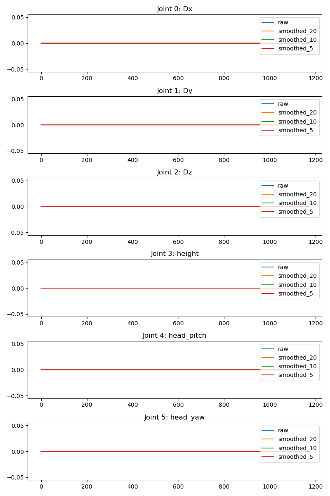

<a id="5-1-2-episode_0_action_velocitypng"></a>
#### 5.1.2 episode_0_action_velocity.png
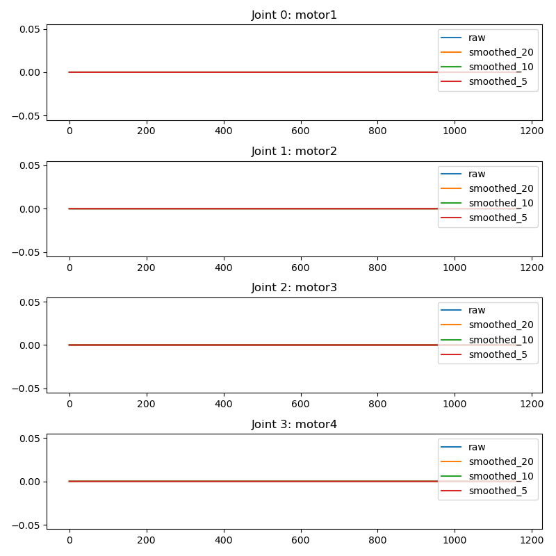

<a id="5-1-3-episode_0_eefpng"></a>
#### 5.1.3 episode_0_eef.png
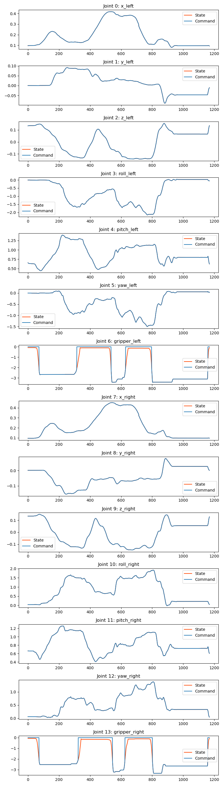

<a id="5-1-4-episode_0_qpospng"></a>
#### 5.1.4 episode_0_qpos.png
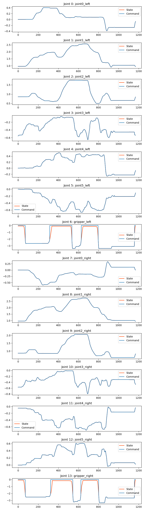

<a id="5-1-5-episode_0_qvelpng"></a>
#### 5.1.5 episode_0_qvel.png
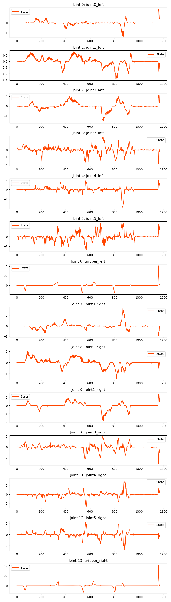

<a id="5-1-6-episode_0_videomp4"></a>
#### 5.1.6 episode_0_video.mp4

<a id="6-training"></a>
## 6. Training
when dataset is large, RTX 4070 will occur error: 

<details>
<summary>error</summary>
```
我运行./02_train.sh，报错：Traceback (most recent call last):
  File "/home/arx/WBCD/ROS2_AC-one_Play/act/train.py", line 534, in <module>
    main()
  File "/home/arx/WBCD/ROS2_AC-one_Play/act/train.py", line 530, in main
    train(args)
  File "/home/arx/WBCD/ROS2_AC-one_Play/act/train.py", line 203, in train
    best_ckpt_info = train_process(train_dataloader, val_dataloader, config, stats)
  File "/home/arx/WBCD/ROS2_AC-one_Play/act/train.py", line 367, in train_process
    epoch_train_summary = train_epoch(train_dataloader, policy, optimizer, policy_config)
  File "/home/arx/WBCD/ROS2_AC-one_Play/act/train.py", line 277, in train_epoch
    forward_dict, result = forward_pass(policy_config, data, policy)
  File "/home/arx/WBCD/ROS2_AC-one_Play/act/train.py", line 303, in forward_pass
    return policy(image_data, image_depth_data, left_states_data, right_states_data,
  File "/home/arx/WBCD/ROS2_AC-one_Play/act/utils/policy.py", line 42, in __call__
    a_hat, (mu, logvar) = self.model(image, depth_image, left_states, right_states, robot_base=robot_base,
  File "/home/arx/.local/lib/python3.10/site-packages/torch/nn/modules/module.py", line 1553, in _wrapped_call_impl
    return self._call_impl(*args, **kwargs)
  File "/home/arx/.local/lib/python3.10/site-packages/torch/nn/modules/module.py", line 1562, in _call_impl
    return forward_call(*args, **kwargs)
  File "/home/arx/WBCD/ROS2_AC-one_Play/act/detr/models/detr_vae.py", line 262, in forward
    hs = self.transformer(self.query_embed.weight,
  File "/home/arx/.local/lib/python3.10/site-packages/torch/nn/modules/module.py", line 1553, in _wrapped_call_impl
    return self._call_impl(*args, **kwargs)
  File "/home/arx/.local/lib/python3.10/site-packages/torch/nn/modules/module.py", line 1562, in _call_impl
    return forward_call(*args, **kwargs)
  File "/home/arx/WBCD/ROS2_AC-one_Play/act/detr/models/transformer.py", line 120, in forward
    memory = self.encoder(src, pos=pos, src_key_padding_mask=is_pad)
  File "/home/arx/.local/lib/python3.10/site-packages/torch/nn/modules/module.py", line 1553, in _wrapped_call_impl
    return self._call_impl(*args, **kwargs)
  File "/home/arx/.local/lib/python3.10/site-packages/torch/nn/modules/module.py", line 1562, in _call_impl
    return forward_call(*args, **kwargs)
  File "/home/arx/WBCD/ROS2_AC-one_Play/act/detr/models/transformer.py", line 147, in forward
    output = layer(output,
  File "/home/arx/.local/lib/python3.10/site-packages/torch/nn/modules/module.py", line 1553, in _wrapped_call_impl
    return self._call_impl(*args, **kwargs)
  File "/home/arx/.local/lib/python3.10/site-packages/torch/nn/modules/module.py", line 1562, in _call_impl
    return forward_call(*args, **kwargs)
  File "/home/arx/WBCD/ROS2_AC-one_Play/act/detr/models/transformer.py", line 258, in forward
    return self.forward_post(src, pos, src_key_padding_mask, src_mask)
  File "/home/arx/WBCD/ROS2_AC-one_Play/act/detr/models/transformer.py", line 229, in forward_post
    src2 = self.self_attn(q, k, value=src, attn_mask=src_mask,
  File "/home/arx/.local/lib/python3.10/site-packages/torch/nn/modules/module.py", line 1553, in _wrapped_call_impl
    return self._call_impl(*args, **kwargs)
  File "/home/arx/.local/lib/python3.10/site-packages/torch/nn/modules/module.py", line 1562, in _call_impl
    return forward_call(*args, **kwargs)
  File "/home/arx/.local/lib/python3.10/site-packages/torch/nn/modules/activation.py", line 1275, in forward
    attn_output, attn_output_weights = F.multi_head_attention_forward(
  File "/home/arx/.local/lib/python3.10/site-packages/torch/nn/functional.py", line 5525, in multi_head_attention_forward
    attn_output_weights = torch.bmm(q_scaled, k.transpose(-2, -1))
torch.OutOfMemoryError: CUDA out of memory. Tried to allocate 324.00 MiB. GPU 0 has a total capacity of 7.63 GiB of which 91.25 MiB is free. Including non-PyTorch memory, this process has 7.52 GiB memory in use. Of the allocated memory 7.29 GiB is allocated by PyTorch, and 74.34 MiB is reserved by PyTorch but unallocated. If reserved but unallocated memory is large try setting PYTORCH_CUDA_ALLOC_CONF=expandable_segments:True to avoid fragmentation.  See documentation for Memory Management  (https://pytorch.org/docs/stable/notes/cuda.html#environment-variables)
```
</details>

in this case, should modify the `batch size` from `32` to `8` here:
`/home/arx/WBCD/ROS2_AC-one_Play/act/train.py`
```
    parser.add_argument('--batch_size', type=int, default=8, help='batch size')
```
after this, then train it via command:
```
cd ~/WBCD/ROS2_AC-one_Play/tools
./02_train.sh 
```
output
```
# 选项“-x”已弃用并可能在 gnome-terminal 的后续版本中移除。
# 使用“-- ”以结束选项并将要执行的命令行追加至其后。
```
new tab

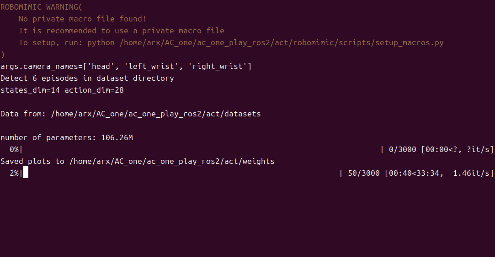
